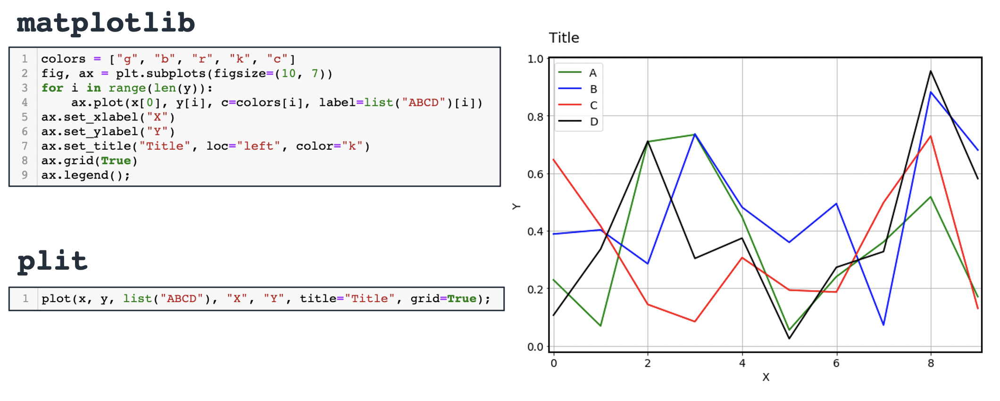

## Press Release

Now Data Scientists and Analysts can quickly create ML and statistical data
visualizations for their presentations, papers, and blog posts. `plit` provides
static graphics that are publication quality “out-of-the-box” with Matplotlib
wrappers for the most common chart types including line charts, scatter plots,
histograms and bar charts. Additionally, `plit` provides a distribution of
templates for common tasks in Statistics and ML including precision recall
curves, model calibration, model accuracy/coverage and more. `plit` empowers Data
Scientist and Analysts to interpret their results and tell their story.

## FAQ

**Q: What is matplotlib?**

Matplotlib was invented in 2003 as an open-source, python-compatible
alternative to MATPLOT. It is the preeminent data visualization tool in python.
It operates as the base vizualization layer for many other vizualization
libraries, each of which with their own strengths and weaknesses. It is widely
used and liked and disliked.

**Q: Why another data visualization library?**

Matplotlib provides unmatched flexibility for static visualizations, however it
requires a significant amount if boiler-plate code to create basic
visualizations. Indeed, 95% of our time is spent on variations of four
visualizations: Line, Scatter, Bar, Histogram. This is the pain point that `plit`
addresses. `plit` automates the undifferentiated heavy-lifting of writing
boilerplate code while maintaining the power of Matplotlib. 

**Q: What are the goals of `plit`?**

1. *A Matplotlib wrapper so that you don’t have to recreate the “boring
stuff”.* Built-in usage of using the Matplotlib Object Oriented API. `**kwargs`
are fed directly to the underlying Matplotlib API. This means it as not
interactive. Want to make it easy to create your own templates.
2. *Wrappers specifically for line charts, scatter plots, histograms, and bar charts
including common options.* Indeed, 95% of time is spent on variations of
four visualizations: Line, Scatter, Bar, Histogram. Some of the common options
that come out of the box include multiple series, flexible specification of
differing marker types and colors, and mandatory legends. 
3. *Combine charts in arbitrary ways within the same figure grid, or use them on their own.*
4. *Templates for tasks in in analysis/evaluation/interpretation that are common for 
many projects.* For example, calibrating the softmax output from a ML model, or
choosing cutoff thresholds with precision/recall curves. 
5. *Graphs are close to publication quality out of the box.* This means that
   have sensible defaults for things like figure size, font sizes, marker size,
DPI, etc....You may want to add your own styling and customizations.

**Q: What functionality is included in `plit` core wrapper?**

The essence of the core wrapper consists of multi-series functionality for line
charts, scatter plots, histograms, and bar charts including markers, colors,
and legends. Graphs are close to publication quality out of the box via a
sensible default stylesheet. Additionally, `plit` provides a distribution of
statistical and ML-specific data visualizations.

**Q: Where does the name come from?**

The naming choice for `plit` is a wordplay on the common alias for Matplotlib,
plt (its only dependency).

**Q: How can I get involved?**

The first way is just to use it. It is available to use for your next project,
blog post, or white paper. The second way is to provide feedback. Looking for
feedback from Matplotlib users and non Matplotlib users. Want to understand how
it makes your life easier and what challenges or limitations you run into. The
last way is to contribute to it. Submit a snippet of code for a recent
visualization you did along with a dataset.

**Q: Can I see how plit compares with Matplotlib with a basic example?**

Consider the following line chart. It takes 9 lines of code in Matplotlib and 1
line of code in plit. This may not seem like a huge difference but consider how
many line charts you create in the course of a project and on top of that all
of the additional customizations you might add to it and you quickly see how
the code can become unwieldy.

